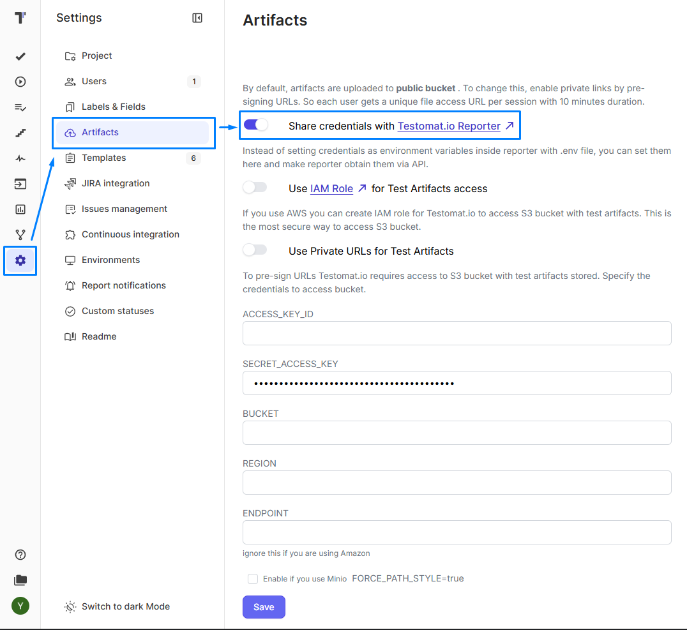
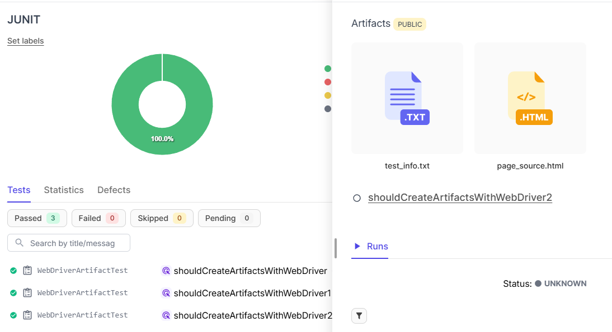
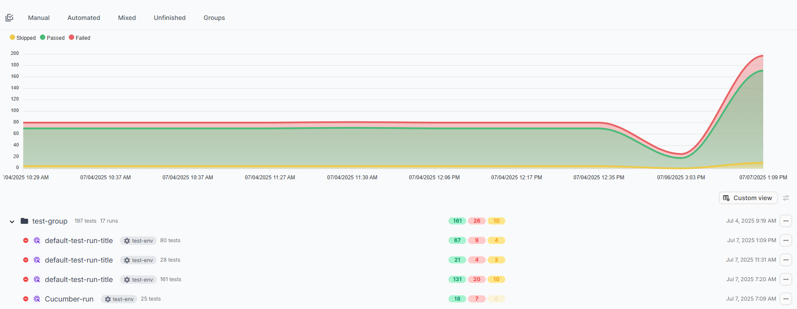

# Testomat.io Java Reporter

---

## What is this?

This is the **official Java reporter** for [Testomat.io](https://testomat.io/) - a powerful test management platform.  
It automatically sends your test results to the platform, giving you comprehensive reports, analytics,  
and team collaboration features.

### 🔄 Current Status & Roadmap

> 🚧 **Actively developed** - New features added regularly!
---

## Features

| Feature                            | Description                                        | JUnit | TestNG | Cucumber | Karate |
|------------------------------------|----------------------------------------------------|:-----:|:------:|:--------:|:------:|
| **Complete framework integration** | Full framework support and compatibility           |   ✅   |   ✅    |    ✅  |   ✅    |
| **Autostart on tests run**         | Automatic integration with test execution          |   ✅   |   ✅    |    ✅  |   ✅    |
| **Shared run**                     | Collaborative test execution sharing               |   ✅   |   ✅    |    ✅  |   ✅    |
| **Test runs grouping**             | Organize and categorize test executions            |   ✅   |   ✅    |    ✅  |   ✅    |
| **Public sharable link**           | Generate public URLs for test run results          |   ✅   |   ✅    |    ✅  |   ✅    |
| **Test code export**               | Export test code from codebase to platform         |   ✅   |   ✅    |    ✅  |   ✅    |
| **Advanced error reporting**       | Detailed test failure/skip descriptions            |   ✅   |   ✅    |    ✅  |   ✅    |
| **TestId import**                  | Import test IDs from testomat.io into the codebase |   ✅   |   ✅    |    ✅  |   ✅    |
| **Test filter by ID**              | Run tests filtered by IDs                          |   ✅   |   ✅    |    ✅  |   ✅    |
| **Parametrized tests support**     | Enhanced support for parameterized testing         |   ✅   |   ✅    |    ✅  |   ✅    |
| **Test artifacts support**         | Screenshots, logs, and file attachments            |   ✅   |   ✅    |    ✅  |   ✅    |
| **Step-by-step reporting**         | Detailed test step execution tracking              |   ✅   |   ✅    |    ✅  |   ✅    |
| **Custom hooks**                   | Allows user's own reporting enhancements           |   ✅   |   ✅    |    ✅  |   ✅    |
| **Other frameworks support**       | Gauge, etc. (Priority may change)                  |   ⏳   |   ⏳    |    ⏳  |   ⏳    |

## 🖥️ Supported test frameworks versions

| What you need | Version | We tested with | Supported java version |
|---------------|:-------:|:--------------:|:----------------------:|
| **JUnit**     |   5.x   |     5.9.2      |        Java 11+        |
| **TestNG**    |   7.x   |     7.7.1      |        Java 11+        |
| **Cucumber**  |   7.x   |     7.14.0     |        Java 11+        |
| **Karate**    |   1.x   |     1.5.0      |        Java 17+        |

---

## Common setup for all frameworks:

1. **Add the latest version** of the dependency to your POM.xml:  
   [TestNG](https://central.sonatype.com/artifact/io.testomat/java-reporter-testng)  
   [JUnit](https://central.sonatype.com/artifact/io.testomat/java-reporter-junit)  
   [Cucumber](https://central.sonatype.com/artifact/io.testomat/java-reporter-cucumber)

2. **Get your API key** from [Testomat.io](https://app.testomat.io/) (starts with `tstmt_`)
3. **Set your API key** as environment variable:
   ```bash
   export testomatio=tstmt_your_key_here
   ```
    - Or add to the `testomatio.properties` :
   ```properties
   testomatio=tstmt_your_key_here
   ```
   Or provide it as a JVM property on run via -D flag.
4. Also provide run title in the `testomatio.run.title` property, otherwise runs will have the name "Default Test Run".
5. IMPORTANT: The reporter will run automatically if the API_KEY is provided in any way! To disable, use
   `testomatio.reporting.disable=1`.

---

## Framework specific setup

### JUnit

**Step 1:** Create file `src/main/resources/junit-platform.properties`

**Step 2:** Add this single line:

   ```properties
      junit.jupiter.extensions.autodetection.enabled=true
   ```

### TestNG

No additional actions needed as TestNG handles the extension implicitly.

### Cucumber

Add `io.testomat.cucumber.listener.CucumberListener` as @ConfigurationParameter value to your TestRunner class.
Like this:

```java
    @ConfigurationParameter(key = PLUGIN_PROPERTY_NAME, value = "pretty, io.testomat.cucumber.listener.CucumberListener")
```

### Karate

Add `KarateHookFactory` as the hook factory `.hookFactory(new KarateHookFactory())` to your TestRunner class.

```java
class KarateTest {

    @Test
    void testParallel() {

        Results results = Runner.path("classpath:karateTests")
            .hookFactory(new KarateHookFactory())
            .outputCucumberJson(true)
            .outputJunitXml(true)
            .parallel(4);

        Assertions.assertEquals(
            0,
            results.getFailCount(),
            results.getErrorMessages()
        );
    }
}
```
---

## Test codebase sync

> For proper usage of this library it is **strongly recommended** to sync your test codebase with Testomat.io base.

### JUnit, TestNG

For this purpose you can use the [Java-Check-Tests CLI](https://github.com/testomatio/java-check-tests).
What this is for:

- Import your test source code to Testomat.io
- Sync test IDs between Testomat.io project and your codebase
- Remove test IDs and related imports if you need to

Use these one-liners to **download jar and update** IDs in one move:

UNIX, MACOS:  
`export TESTOMATIO_URL=... && \export TESTOMATIO=... && curl -L -O https://github.com/testomatio/java-check-tests/releases/latest/download/java-check-tests.jar && java -jar java-check-tests.jar update-ids`

WINDOWS cmd:  
`set TESTOMATIO_URL=...&& set TESTOMATIO=...&& curl -L -O https://github.com/testomatio/java-check-tests/releases/latest/download/java-check-tests.jar&& java -jar java-check-tests.jar update-ids`

**Where TESTOMATIO_URL is server URL and TESTOMATIO is your project API key.**  
**Be careful with whitespaces in the Windows command.**

> For more details please read the description of full CLI functionality here:  
> https://github.com/testomatio/java-check-tests

---
**For most cases, the library is ready to use with this setup**

---

## Configuration Options

### Required Settings

   ```properties
    # Your Testomat.io project API key (find it in your project settings)
testomatio=tstmt_your_key_here
   ```

Or provide it as JVM property or ENV variable.  
IMPORTANT: The reporter will run automatically if the API_KEY is provided in any way!

### Customization

Here are the options to customize the reporting in the way you need:

| Setting                            | What it does                          | Default             | Example                                       |
|------------------------------------|---------------------------------------|---------------------|-----------------------------------------------|
| **`testomatio.reporting.disable`** | Disables reporting                    | none                | `true` / `1`                                  |
| **`testomatio.run.title`**         | Custom name for your test run         | `default_run_title` | `"Nightly Regression Tests"`                  |
| **`testomatio.env`**               | Environment name (dev, staging, prod) | _(none)_            | `"staging"`                                   |
| **`testomatio.run.group`**         | Group related runs together           | _(none)_            | `"sprint-23"`                                 |
| **`testomatio.publish`**           | Make results publicly shareable       | _(private)_         | Any not null/empty/"0" string, "0" to disable |

### 🔗 Advanced Integration

| Setting                             | What it does                             | Example                    |
|-------------------------------------|------------------------------------------|----------------------------|
| **`testomatio.url`**                | Custom Testomat.io URL (for enterprise)  | `https://app.testomat.io/` |
| **`testomatio.run.id`**             | Add results to existing run              | `"run_abc123"`             |
| **`testomatio.create`**             | Auto-create missing tests in Testomat.io | `true` / `1`               |
| **`testomatio.shared.run`**         | Shared run name for team collaboration   | `any_name`                 |
| **`testomatio.shared.run.timeout`** | How long to wait for shared run          | `3600` / `1`               |
| **`testomatio.export.required`**    | Exports your tests code to Testomat.io   | `true` / `1`               |

---


## 🏷️ Test Identification & Titles

Connect your code tests directly to your Testomat.io test cases using simple annotations!
As mentioned above, test IDs are recommended to be synced with Java-Check-Tests CLI.
But @Title usage is up to you.

### 📋 For JUnit & TestNG

Use `@TestId` and `@Title` annotations to make your tests perfectly trackable:

> 💡 **Tip**: With `@TestId` annotations in place, you can filter and run specific tests by their IDs - see [Test Filtering by ID](#-test-filtering-by-id) below.

```java
import com.testomatio.reporter.annotation.TestId;
import com.testomatio.reporter.annotation.Title;

public class LoginTests {

    @Test
    @TestId("auth-001")
    @Title("User can login with valid credentials")
    public void testValidLogin() {
        // Your test code here
    }

    @Test
    @TestId("auth-002")
    @Title("Login fails with invalid password")
    public void testInvalidPassword() {
        // Your test code here
    }

    @Test
    @Title("User sees helpful error message")  // Just title, auto-generated ID
    public void testErrorMessage() {
        // Your test code here
    }
}
```

### 🥒 For Cucumber

Use tags to identify your scenarios:

```gherkin
Feature: User Authentication

  @TestId:auth-001
  Scenario: Valid user login
    Given user is on login page
    When user enters valid credentials
    Then user should be logged in successfully

  @TestId:auth-002
  Scenario: Invalid password login
    Given user is on login page
    When user enters invalid password
    Then login should fail

  @TestId:auth-003
  Scenario: Error message display
    Given user is on login page
    When login fails
    Then error message should be displayed
```

### For Karate

```gherkin
Feature: Posts API

  Background:
    * url 'https://jsonplaceholder.typicode.com'
    * def assertStatus = Java.type('helpers.AssertStatus')

  @Title:Get_all_posts @TestId:Tpost0001 @Attachments:logs/karate.log
  Scenario: Get all posts
    Given path 'posts'
    When method get
    Then eval assertStatus.checkStatusCode(responseStatus, 200)
    And match response[0].id != null

  @Title:Get_single_post @TestId:Tpost0002
  Scenario: Get single post
    Given path 'posts', 1
    When method get
    Then eval assertStatus.checkStatusCode(responseStatus, 200)
    And match response.id == 1

  @Title:Get_comments_for_post @TestId:Tpost0003
  Scenario: Get comments for post
    Given path 'posts', 1, 'comments'
    When method get
    Then eval assertStatus.checkStatusCode(responseStatus, 200)
    And match response[0].postId == 1

  @Title:Validate_post_titles
  Scenario Outline: Validate post titles <TestId>
    Given path 'posts', <id>
    When method get
    Then eval assertStatus.checkStatusCode(responseStatus, 200)
    And match response.title != null

    Examples:
      | id | TestId    |
      | 1  | Tpost0041 |
      | 2  | Tpost0042 |
      | 3  | Tpost0043 |

  @Title:Create_post @TestId:Tpost0005
  Scenario: Create post
    Given path 'posts'
    And request { title: 'foo', body: 'bar', userId: 1 }
    When method post
    Then eval assertStatus.checkStatusCode(responseStatus, 200)
    And match response.id != null

```

## 📎 Test Artifacts Support

The Java Reporter supports attaching files (screenshots, logs, videos, etc.) to your test results and uploading them to
S3-compatible storage.  
Artifacts handling is enabled by default, but it won't affect the run if there are no artifacts provided (see options
below).

### Configuration

Artifacts are stored in external S3 buckets. S3 Access can be configured in **two different ways**:

1. Make configurations on the [Testomat.io](https://app.testomat.io):  
   Choose your project -> click **Settings** button on the left panel -> click **Artifacts** -> Toggle "**Share
   credentials**..."

   

2. Provide options as environment variables/jvm property/testomatio.properties file.

> NOTE: Environment variables(env/jvm/testomatio.properties) take precedence over server-provided credentials.

| Setting                       | Description                                      | Default     |
|-------------------------------|--------------------------------------------------|-------------|
| `testomatio.artifact.disable` | Completely disable artifact uploading            | `false`     |
| `testomatio.artifact.private` | Keep artifacts private (no public URLs)          | `false`     |
| `s3.force-path-style`         | Use path-style URLs for S3-compatible storage    | `false`     |
| `s3.endpoint`                 | Custom endpoint to be used with force-path-style | `false`     |
| `s3.bucket`                   | Provides bucket name for configuration           |             |
| `s3.access-key-id`            | Access key for the bucket                        |             |
| `s3.region`                   | Bucket region                                    | `us-west-1` |

**Note**: S3 credentials can be configured either in properties file or provided automatically on Testomat.io UI.
Environment variables take precedence over server-provided credentials.

### Usage

Use the `Testomatio` facade to attach files to your tests.
Multiple files can be provided to the `Testomatio.artifact(String ...)` method.

```java
import io.testomat.core.facade.Testomatio;

public class MyTest {

    @Test
    public void testWithScreenshot() {
        // Your test logic

        // Attach artifacts (screenshots, logs, etc.)
        Testomatio.artifact(
                "/path/to/screenshot.png",
                "/path/to/test.log"
        );
    }
}
```

Karate

```gherkin
  @Attachments:logs/karate.log
  Scenario: Get all posts
    Given path 'posts'
    When method get
    Then eval assertStatus.checkStatusCode(responseStatus, 200)
    And match response[0].id != null
```

Please make sure you provide the path to the artifact file including its extension.

### How It Works

1. **S3 Upload**: Files are uploaded to your S3 bucket with organized folder structure
2. **Link Generation**: Public URLs are generated and attached to test results
3. Artifacts are visible at the test info on UI

As a result, you will see something like this in the UI after the run is completed:



---

## 📝 Step-by-Step Reporting

Track detailed test execution flow using the `@Step` annotation.  
Steps provide granular visibility into test logic and help identify exactly where tests succeed or fail.


### Setup

Add AspectJ weaver to your test execution via maven-surefire-plugin:

```xml
<build>
    <plugins>
        <plugin>
            <groupId>org.apache.maven.plugins</groupId>
            <artifactId>maven-surefire-plugin</artifactId>
            <version>3.2.2</version>
            <configuration>
                <argLine>
                    -javaagent:"${settings.localRepository}/org/aspectj/aspectjweaver/1.9.24/aspectjweaver-1.9.24.jar"
                </argLine>
            </configuration>
        </plugin>
    </plugins>
</build>
```

### Basic Usage

Annotate methods with `@Step` to track their execution:

```java
import io.testomat.core.annotation.Step;

public class LoginTest {

    @Test
    public void testUserLogin() {
        openLoginPage();
        enterCredentials("user@example.com", "password123");
        clickLoginButton();
        verifyUserLoggedIn();
    }

    @Step("Open login page")
    private void openLoginPage() {
        driver.get("https://example.com/login");
    }

    @Step("Enter credentials")
    private void enterCredentials(String email, String password) {
        driver.findElement(By.id("email")).sendKeys(email);
        driver.findElement(By.id("password")).sendKeys(password);
    }

    @Step("Click login button")
    private void clickLoginButton() {
        driver.findElement(By.id("login-btn")).click();
    }

    @Step("Verify user is logged in")
    private void verifyUserLoggedIn() {
        assertTrue(driver.findElement(By.id("user-profile")).isDisplayed());
    }
}
```

### Parameter Substitution

Use placeholders to make step descriptions dynamic:

**Indexed placeholders** (always work):
```java
@Step("Search for {0} in category {1}")
private void search(String query, String category) {
    // Step will show: "Search for laptop in category electronics"
}
```

**Named placeholders** (require `-parameters` compiler flag):
```java
@Step("Login as {username} with {password}")
private void login(String username, String password) {
    // Step will show: "Login as admin with secret123"
}
```

To enable named placeholders, add to `pom.xml`:
```xml
<plugin>
    <groupId>org.apache.maven.plugins</groupId>
    <artifactId>maven-compiler-plugin</artifactId>
    <configuration>
        <parameters>true</parameters>
    </configuration>
</plugin>
```

### What You'll See

Steps appear in test reports with:
- Step title
- Execution duration
- Order of execution

This provides complete transparency into test flow and helps debug failures quickly.

---

## 🎯 Test Filtering by ID

**JUnit & TestNG only**

> **Note**: Cucumber tests can be filtered using native Cucumber tags functionality (`@tag` in feature files and `cucumber.filter.tags` property).

Run specific tests by their `@TestId` values using the `-Dids` parameter. This is useful for:
- Running smoke tests or critical path tests
- Re-running failed tests from previous runs
- Debugging specific test cases
- CI/CD pipelines with test subsets

### Usage

Filter tests by comma-separated test IDs:

```bash
# Run single test
mvn test -Dids=smoke-001

# Run multiple tests
mvn test -Dids=smoke-001,smoke-002,smoke-003

# Combine with other parameters
mvn test \
  -Dids=smoke-001,smoke-002 \
  -Dtestomatio=tstmt_your_key \
  -Dtestomatio.run.title="Smoke Tests"
```

### Example

```java
public class LoginTests {

    @Test
    @TestId("smoke-001")
    public void testValidLogin() {
        // This test will run with -Dids=smoke-001
    }

    @Test
    @TestId("smoke-002")
    public void testInvalidPassword() {
        // This test will run with -Dids=smoke-002
    }

    @Test
    public void testOtherFeature() {
        // This test will be skipped when filtering by IDs
    }
}
```

### Behavior

- **Tests without `@TestId`**: Included when no filter is applied; skipped when `-Dids` is provided (TestNG only)
- **Tests with matching IDs**: Always run when their ID is in the filter list
- **Tests with non-matching IDs**: Skipped

---

## 💡 Library Usage Examples

### Basic Usage

```bash
# Simple run with custom title
mvn test \
  -Dtestomatio=tstmt_your_key \
  -Dtestomatio.run.title="My Feature Tests"
```

### Team Collaboration

```bash
# Shared run that team members can contribute to
mvn test \
  -Dtestomatio=tstmt_your_key \
  -Dtestomatio.shared.run="integration-tests" \
  -Dtestomatio.env="staging"
```

### Stakeholder Demo

```bash
# Public report for sharing with stakeholders
mvn test \
  -Dtestomatio=tstmt_your_key \
  -Dtestomatio.run.title="Demo for Product Team" \
  -Dtestomatio.publish=1
```

---

## 📊 What You'll See

When your tests start running, you'll see helpful output like this:


**You get two types of links:**

- **🔒 Private Link**: Full access on Testomat.io platform (for your team)
- **🌐 Public Link**: Shareable read-only view (only if you set `testomatio.publish=1`)

And the dashboard - something like this:



---

## Advanced customization

There are void hooks in the listeners that allow you to customize reporting much more.
These hooks are located in the listeners' tests lifecycle methods according to their names.
External API calls, logging, and any custom logic can be added to the hooks.
The hooks are executed **after** the lifecycle method logic finishes and do not replace it.

### JUnit, TestNG

1. Complete the Simple Setup first
2. Create a new class that extends JunitListener or TestNgListener, based on your needs.
    Implement protected methods from the library listener and add custom logic to them.

3. Create the `services` directory:

   ```
      📁 src/main/resources/META-INF/services/
   ```

4. Create the right configuration file:
    
    | Framework    | Create this file:                           |
    |--------------|---------------------------------------------|
    | **JUnit 5**  | `org.junit.jupiter.api.extension.Extension` |
    | **TestNG**   | `org.testng.ITestNGListener`                |

5. Add your custom class path to the file:

   ```properties
    com.yourcompany.yourproject.CustomListener
   ```
### Cucumber

1. Complete the Simple Setup first
2. Create a new class that extends CucumberListener.
   Implement protected methods from the library listener and add custom logic to them.
3. Add `com.yourcompany.yourproject.YOUR_CUSTOM_LISTENER` as @ConfigurationParameter value to your TestRunner class.
   Like this:

```java
    @ConfigurationParameter(key = PLUGIN_PROPERTY_NAME, value = "pretty, com.yourcompany.yourproject.YOUR_CUSTOM_LISTENER")
```

### Karate
1. Create your custom karate hook that implements method of RuntimeHook `public class MyHook implements RuntimeHook {}`
2. Implement and override necessary methods
3. Register the hook using a factory
```java
   Runner.path("classpath:karateTests")
      .hookFactory(KarateHookFactory.create(MyHook::new))
      .outputCucumberJson(true)
      .outputJunitXml(true)
      .parallel(4);
```
4. You can register multiple hooks by passing multiple factories
```java
    Runner.path("classpath:karateTests")
      .hookFactory(KarateHookFactory.create(
            MyHook::new,
            AnotherHook::new,
            CustomHook::new))
      .outputCucumberJson(true)
      .outputJunitXml(true)
      .parallel(4);
```

---

## 🆘 Troubleshooting

### Tests not appearing in Testomat.io?

1. **Check your API key** - it should start with `tstmt_` and be related to the project you're looking at.
2. **Verify internet connection** - the reporter needs to reach `app.testomat.io`
3. **Enable auto-creation** - add `-Dtestomatio.create=true` to create missing tests

### Framework not detected?

1. **JUnit 5**: Make sure `junit-platform.properties` exists with autodetection enabled
2. **Cucumber**: Verify the listener is in your `@CucumberOptions` plugins
3. **TestNG**: Should work automatically if nothing is overridden - check your TestNG version (need 7.x)

---

### Nothing helps?

1. Create an issue. We'll fix it!

> 💝 **Love this tool?** Star the repo and share with your team!