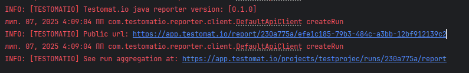

# 🚀 Testomat.io Java Reporter

> **Transform your test reporting experience - realtime + easy analytics!**   
> Connect your Java tests directly to Testomat.io with minimal setup and maximum insight.

## 🎯 Quick Start 

1. **Add dependency** to your `pom.xml` with classifier to align your test framework:
   ```xml
   <dependency>
       <groupId>io.testomat</groupId>
       <artifactId>java-reporter-distribution</artifactId>
       <version>0.6.1</version>
       <classifier>junit</classifier>
   </dependency>
   ```
   By now supported frameworks are:
   - Junit5
   - TestNG
   - Cucumber  
   (use lowercase in the classifier tag)
   
2. **Get your API key** from [Testomat.io](https://app.testomat.io/) (starts with `tstmt_`)

3. **Set your API key** as environment variable:
   ```bash
   export testomatio.api.key=tstmt_your_key_here
   ```

4. **Run your tests** - that's it! 🎉

---

## 📖 What is this?

This is the **official Java reporter** for [Testomat.io](https://testomat.io/) - a powerful test management platform. It automatically sends your test results to the cloud, giving you beautiful reports, analytics, and team collaboration features.

### 🌟 Why you'll love it

- ✅ **Zero configuration** for most projects
- ✅ **Works with your existing tests** (JUnit, TestNG, Cucumber)
- ✅ **Real-time reporting** as tests run
- ✅ **Team collaboration** with shared reports
- ✅ **Historical tracking** of test trends
- ✅ **Public shareable reports** for stakeholders

### 🔄 Current Status & Roadmap

> 🚧 **Actively developed** - New features added regularly!

#### ✅ Ready to Use (Current Features)
- ✅ **Complete framework integration** - JUnit5, TestNG, and Cucumber support
- ✅ **Automatic test discovery** - Zero-config test detection and reporting
- ✅ **Customizable run parameters** - Full control over test run configuration
- ✅ **Async test processing** - High-performance parallel result processing
- ✅ **Advanced customization** - Override core classes for custom behavior
- ✅ **Test run grouping** - Organize and merge related test runs
- ✅ **Team collaboration** - Shared runs and real-time reporting

#### 🚀 Coming Soon (Planned Features)
- ⏳ **Test artifacts support** - Screenshots, logs, and file attachments
- ⏳ **Step-by-step reporting** - Detailed test step execution tracking
- ⏳ **Enhanced error reporting** - Stack traces and failure analysis
- ⏳ **Integration hooks** - Pre/post test execution callbacks
- ⏳ **Advanced filtering** - Custom test selection and reporting rules

## 🖥️ System Requirements

| What you need | Version | We tested with |
|--------------|---------|----------------|
| ☕ **Java** | 11 or newer | All versions |
| 🧪 **JUnit** | 5.x | 5.9.2 |
| 🧪 **TestNG** | 7.x | 7.7.1 |
| 🥒 **Cucumber** | 7.x | 7.14.0 |

## 📦 Installation

### Maven
```xml
<dependency>
    <groupId>io.testomat</groupId>
    <artifactId>java-reporter-distribution</artifactId>
    <version>0.6.0</version>
    <classifier>xxx</classifier>
</dependency>
```

> 💡 **Heads up!** This library includes `jackson-databind 2.15.2` - no conflicts expected with modern projects.

---

## ⚡ Setup Guide

> **Choose your adventure!** Most people should start with **Simple Setup** 👇

### 🎯 Simple Setup (Recommended for 99% of users)

This gets you running in under 2 minutes with zero custom code.

#### 🧪 For JUnit 5 Projects

**Step 1:** Create file `src/main/resources/junit-platform.properties`

**Step 2:** Add this single line:
```properties
junit.jupiter.extensions.autodetection.enabled = true
```

**Step 3:** Run your tests with API key:
```bash
mvn test -Dtestomatio.api.key=tstmt_your_key_here
```

**That's it!** ✨ Your tests now report to Testomat.io automatically.

#### 🥒 For Cucumber Projects

**Step 1:** Add our listener to your test runner:

```java
@RunWith(Cucumber.class)
@CucumberOptions(
        features = "src/test/resources/features",
        glue = {"steps"},
        plugin = {
                "pretty",
                "json:target/cucumber-reports/",
                "html:target/cucumber-reports/",
                "io.testomat.cucumber.listener.CucumberListener"  // 👈 Add this line
        }
)
public class TestRunner {
}
```


**Step 2:** Run with your API key:
```bash
   mvn test -Dtestomatio.api.key=tstmt_your_key_here
```

#### 🧪 For TestNG Projects

**Good news!** TestNG works automatically - just add your API key when running tests:

```bash
mvn test -Dtestomatio.api.key=tstmt_your_key_here
```

No extra configuration needed! 🎉

---

### 🔧 Advanced Setup (For Power Users)

> **⚠️ Only use this if you need custom behavior** - like adding extra logic to test lifecycle events.

This lets you customize how the reporter works by overriding core classes:
- `CucumberListener` - Controls Cucumber test reporting
- `TestNgListener` - Controls TestNG test reporting
- `JunitListener` - Controls JUnit test reporting

#### When would you need this?
- Adding custom API calls during test execution
- Integrating with other tools
- Custom test result processing
- Advanced filtering or modification of results

#### Setup Steps:

**Step 1:** Complete the Simple Setup first (except for Cucumber-only projects)

**Step 2:** Create the services directory:
```
📁 src/main/resources/META-INF/services/
```

**Step 3:** Create the right configuration file:

| Framework | Create this file: |
|-----------|------------------|
| **JUnit 5** | `org.junit.jupiter.api.extension.Extension` |
| **TestNG** | `org.testng.ITestNGListener io.cucumber.plugin.Plugin` |
| **Cucumber** | `io.cucumber.plugin.Plugin` |

**Step 4:** Add your custom class path to the file:
```properties
com.yourcompany.yourproject.CustomListener
```

**Step 5:** For Cucumber, update your TestRunner to use your custom class instead of ours.

#### Example Custom Listener:
```java
public class CustomCucumberListener extends CucumberListener {
    @Override
    public void onTestStart(TestCase loaderTestCase) {
        // Your custom logic here
        super.onTestStart(loaderTestCase);
        // More custom logic
    }
}
```

---

## 🎮 Configuration Options

### 🔑 Required Settings

```properties
# Your Testomat.io project API key (find it in your project settings)
testomatio.api.key=tstmt_your_key_here
```

### 🎨 Customization Options

Make your test runs exactly how you want them:

| Setting | What it does | Default | Example |
|---------|-------------|---------|---------|
| **`testomatio.run.title`** | Custom name for your test run | `default_run_title` | `"Nightly Regression Tests"` |
|**`testomatio.env`** | Environment name (dev, staging, prod) | _(none)_ | `"staging"` |
|**`testomatio.run.group`** | Group related runs together | _(none)_ | `"sprint-23"` |
|**`testomatio.publish`** | Make results publicly shareable | _(private)_ | `1` |

### ⚙️ Performance Tuning

| Setting | What it does | Default | Min Value |
|---------|-------------|---------|-----------|
|**`testomatio.batch.size`** | How many test results to send at once | `5` | `5` |
| **`testomatio.batch.flush.interval`** | How often to send results (seconds) | `5` | `5` |

### 🔗 Advanced Integration

| Setting | What it does | Example |
|---------|-------------|---------|
|**`testomatio.url`** | Custom Testomat.io URL (for enterprise) | `https://app.testomat.io/` |
|**`testomatio.run.id`** | Add results to existing run | `"run_abc123"` |
|**`testomatio.create`** | Auto-create missing tests in Testomat.io | `true` |
|**`testomatio.shared.run`** | Shared run name for team collaboration | `"team-integration-tests"` |
|**`testomatio.shared.run.timeout`** | How long to wait for shared run | `3600` |

---
## 🏷️ Test Identification & Titles

Connect your code tests directly to your Testomat.io test cases using simple annotations!

### 📋 For JUnit & TestNG

Use `@TestId` and `@Title` annotations to make your tests perfectly trackable:

```java
import com.testomatio.reporter.annotation.TestId;
import com.testomatio.reporter.annotation.Title;

public class LoginTests {
    
    @Test
    @TestId("auth-001")
    @Title("User can login with valid credentials")
    public void testValidLogin() {
        // Your test code here
    }
    
    @Test
    @TestId("auth-002") 
    @Title("Login fails with invalid password")
    public void testInvalidPassword() {
        // Your test code here
    }
    
    @Test
    @Title("User sees helpful error message")  // Just title, auto-generated ID
    public void testErrorMessage() {
        // Your test code here
    }
}
```

### 🥒 For Cucumber

Use tags to identify your scenarios:

```gherkin
Feature: User Authentication

  @TestId:auth-001
  Scenario: Valid user login
    Given user is on login page
    When user enters valid credentials
    Then user should be logged in successfully

  @TestId:auth-002
  Scenario: Invalid password login
    Given user is on login page
    When user enters invalid password
    Then login should fail

   @TestId:auth-003
  Scenario: Error message display
    Given user is on login page
    When login fails
    Then error message should be displayed
```
- **@TestId**: Links your code test to specific test case in Testomat.io


**Result:** Your Testomat.io dashboard shows exactly which tests ran, with clear titles and perfect traceability! 🎯

---

## 💡 Usage Examples

### Basic Usage
```bash
# Simple run with custom title
mvn test \
  -Dtestomatio.api.key=tstmt_your_key \
  -Dtestomatio.run.title="My Feature Tests"
```

### Team Collaboration
```bash
# Shared run that team members can contribute to
mvn test \
  -Dtestomatio.api.key=tstmt_your_key \
  -Dtestomatio.shared.run="integration-tests" \
  -Dtestomatio.env="staging"
```

### Stakeholder Demo
```bash
# Public report for sharing with stakeholders
mvn test \
  -Dtestomatio.api.key=tstmt_your_key \
  -Dtestomatio.run.title="Demo for Product Team" \
  -Dtestomatio.publish=1
```
---

## 📊 What You'll See

When your tests start running, you'll see helpful output like this:



**You get two types of links:**
- **🔒 Private Link**: Full access on Testomat.io platform (for your team)
- **🌐 Public Link**: Shareable read-only view (only if you set `testomatio.publish=1`)

And the dashboard - something like this:  


---

## 🆘 Troubleshooting

### Tests not appearing in Testomat.io?

1. **Check your API key** - it should start with `tstmt_`
2. **Verify internet connection** - the reporter needs to reach `app.testomat.io`
3. **Check test names** - make sure they match your Testomat.io project structure
4. **Enable auto-creation** - add `-Dtestomatio.create=true` to create missing tests


### Framework not detected?

1. **JUnit 5**: Make sure `junit-platform.properties` exists with autodetection enabled
2. **Cucumber**: Verify the listener is in your `@CucumberOptions` plugins
3. **TestNG**: Should work automatically if nothing is overridden - check your TestNG version (need 7.x)

---

## 🎉 What's Next?

1. **Explore Testomat.io features**: Analytics, team reports
3. **Try advanced features**: Test case management, requirements tracing
4. **Join the community**: [Documentation](https://docs.testomat.io/) • [Support](https://testomat.io/support)

---

> 💝 **Love this tool?** Star the repo and share with your team!