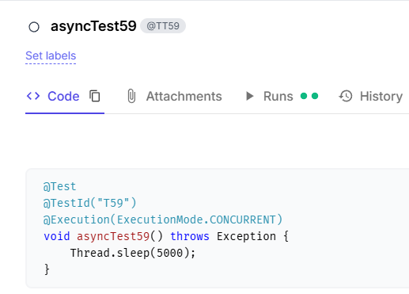

# Testomat.io Java Reporter

**Transform your test reporting experience - realtime + easy analytics!  
Connect your Java tests directly to Testomat.io with minimal setup and maximum insight.**

---

## 📖 What is this?

This is the **official Java reporter** for [Testomat.io](https://testomat.io/) - a powerful test management platform.  
It automatically sends your test results to the platform, giving you comprehensive reports, analytics,  
and team collaboration features.

### 🔄 Current Status & Roadmap

> 🚧 **Actively developed** - New features added regularly!

## Features

| Feature                            | Description                                        | JUnit | TestNG | Cucumber |
|------------------------------------|----------------------------------------------------|:-----:|:------:|:--------:|
| **Complete framework integration** | Full framework support and compatibility           |   ✅   |   ✅    |    ✅     |
| **Autostart on tests run**         | Automatic integration with test execution          |   ✅   |   ✅    |    ✅     |
| **Shared run**                     | Collaborative test execution sharing               |   ✅   |   ✅    |    ✅     |
| **Test runs grouping**             | Organize and categorize test executions            |   ✅   |   ✅    |    ✅     |
| **Public sharable link**           | Generate public URLs for test run results          |   ✅   |   ✅    |    ✅     |
| **Test code export**               | Export test code from codebase to platform         |   ✅   |   ✅    |    ✅     |
| **Advanced error reporting**       | Detailed test failure/skip descriptions            |   ✅   |   ✅    |    ✅     |
| **TestId import**                  | Import test IDs from testomat.io into the codebase |   ✅   |   ✅    |    ✅     |
| **Parametrized tests support**     | Enhanced support for parameterized testing         |    ✅   |   ✅    |    ⏳     |
| **Test artifacts support**         | Screenshots, logs, and file attachments            |   ⏳   |   ⏳    |    ⏳     |
| **Step-by-step reporting**         | Detailed test step execution tracking              |   ⏳   |   ⏳    |    ⏳     |
| **Other frameworks support**       | Karate, Gauge, etc. (Priority may change)          |       |        |          |

## 🖥️ Supported test frameworks versions

| What you need | Version | We tested with |
|---------------|:-------:|:--------------:|
| **JUnit**     |   5.x   |     5.9.2      |
| **TestNG**    |   7.x   |     7.7.1      |
| **Cucumber**  |   7.x   |     7.14.0     |

> - Supported Java 11+

## The reporter depends on:

- `jackson-databind 2.15.2`
- `javaparser-core 3.27.0`

---

## Common setup for all frameworks:

1. **Add dependency** to your `pom.xml`:

   ```xml
   <dependency>
       <groupId>io.testomat</groupId>
       <artifactId>java-reporter-/frameworkName/</artifactId>
       <version>0.7.0</version>
   </dependency>
   ``` 
2. create the `testomatio.properties` file in your `resources` folder and add into it:
   ```properties
   testomatio.listening=true
   ```
3. **Get your API key** from [Testomat.io](https://app.testomat.io/) (starts with `tstmt_`)
4. **Set your API key** as environment variable:
   ```bash
   export testomatio.api.key=tstmt_your_key_here
   ```
    - Or add to the `testomatio.properties` :
   ```properties
   testomatio.api.key=tstmt_your_key_here
   ```

5. Also provide run title in the `testomatio.run.title` property otherwise runs will have name "Default Test Run".

---

## Framework specific setup

### JUnit

> - Supported versions: 5.x
> - Tested on 5.9.2

**Step 1:** Create file `src/main/resources/junit-platform.properties`

**Step 2:** Add this single line:

   ```properties
      junit.jupiter.extensions.autodetection.enabled=true
   ```

### TestNG

No additional actions needed as TestNG handles the extension implicitly.

### Cucumber

**Add our listener to your test runner:**

```java

@RunWith(Cucumber.class)
@CucumberOptions(
        features = "src/test/resources/features",
        glue = {"steps"},
        plugin = {
                "pretty",
                "json:target/cucumber-reports/",
                "html:target/cucumber-reports/",
                "io.testomat.cucumber.listener.CucumberListener"  // 👈 Add this line
        }
)
public class TestRunner {
}
```

---

### 🔧 Advanced Setup (For Power Users)

> **⚠️ Only use this if you need custom behavior** - like adding extra logic to test lifecycle events.

This lets you customize how the reporter works by overriding core classes:

- `CucumberListener` - Controls Cucumber test reporting
- `TestNgListener` - Controls TestNG test reporting
- `JunitListener` - Controls JUnit test reporting

#### When would you need this?

- Adding custom API calls during test execution
- Integrating with other tools
- Custom test result processing
- Advanced filtering or modification of results

#### Setup Steps:

**Step 1:** Complete the Simple Setup first (except for Cucumber-only projects)

**Step 2:** Create the services directory:

   ```
      📁 src/main/resources/META-INF/services/
   ```

**Step 3:** Create the right configuration file:

| Framework    | Create this file:                                      |
|--------------|--------------------------------------------------------|
| **JUnit 5**  | `org.junit.jupiter.api.extension.Extension`            |
| **TestNG**   | `org.testng.ITestNGListener io.cucumber.plugin.Plugin` |
| **Cucumber** | `io.cucumber.plugin.Plugin`                            |

**Step 4:** Add your custom class path to the file:

   ```properties
    com.yourcompany.yourproject.CustomListener
   ```

**Step 5:** For Cucumber, update your TestRunner to use your custom class instead of ours.

#### Example Custom Listener:

   ```java
      public class CustomCucumberListener extends CucumberListener {
    @Override
    public void onTestStart(TestCase testCase) {
        // Your custom logic here
        super.onTestStart(testCase);
        // More custom logic
    }
}
   ```

---

## 🎮 Configuration Options

### Required Settings

   ```properties
      # Your Testomat.io project API key (find it in your project settings)
testomatio.api.key=tstmt_your_key_here
testomatio.listening=ture
   ```

### 🎨 Customization Options

Make your test runs exactly how you want them:

| Setting                    | What it does                          | Default             | Example                      |
|----------------------------|---------------------------------------|---------------------|------------------------------|
| **`testomatio.run.title`** | Custom name for your test run         | `default_run_title` | `"Nightly Regression Tests"` |
| **`testomatio.env`**       | Environment name (dev, staging, prod) | _(none)_            | `"staging"`                  |
| **`testomatio.run.group`** | Group related runs together           | _(none)_            | `"sprint-23"`                |
| **`testomatio.publish`**   | Make results publicly shareable       | _(private)_         | `1`                          |

### 🔗 Advanced Integration

| Setting                             | What it does                             | Example                    |
|-------------------------------------|------------------------------------------|----------------------------|
| **`testomatio.url`**                | Custom Testomat.io URL (for enterprise)  | `https://app.testomat.io/` |
| **`testomatio.run.id`**             | Add results to existing run              | `"run_abc123"`             |
| **`testomatio.create`**             | Auto-create missing tests in Testomat.io | `true`                     |
| **`testomatio.shared.run`**         | Shared run name for team collaboration   | `"team-integration-tests"` |
| **`testomatio.shared.run.timeout`** | How long to wait for shared run          | `3600`                     |
| **`testomatio.export.required`**    | Exports your tests code to Testomat.io   | `true`                     |

---

## 🏷️ Test Identification & Titles

Connect your code tests directly to your Testomat.io test cases using simple annotations!

### 📋 For JUnit & TestNG

Use `@TestId` and `@Title` annotations to make your tests perfectly trackable:

```java
import com.testomatio.reporter.annotation.TestId;
import com.testomatio.reporter.annotation.Title;

public class LoginTests {

    @Test
    @TestId("auth-001")
    @Title("User can login with valid credentials")
    public void testValidLogin() {
        // Your test code here
    }

    @Test
    @TestId("auth-002")
    @Title("Login fails with invalid password")
    public void testInvalidPassword() {
        // Your test code here
    }

    @Test
    @Title("User sees helpful error message")  // Just title, auto-generated ID
    public void testErrorMessage() {
        // Your test code here
    }
}
```

### 🥒 For Cucumber

Use tags to identify your scenarios:

```gherkin
Feature: User Authentication

  @TestId:auth-001
  Scenario: Valid user login
    Given user is on login page
    When user enters valid credentials
    Then user should be logged in successfully

  @TestId:auth-002
  Scenario: Invalid password login
    Given user is on login page
    When user enters invalid password
    Then login should fail

  @TestId:auth-003
  Scenario: Error message display
    Given user is on login page
    When login fails
    Then error message should be displayed
```

- **@TestId**: Links your code test to specific test case in Testomat.io

**Result:** Your Testomat.io dashboard shows exactly which tests ran, with clear titles and perfect traceability! 🎯

## Test ids import

You can either add @TestId() annotations manually or import them from the testomat.io using the **Java-Chek-Tests**
CLI.  
Use these oneliners to **download jar and update** ids in one move

> - UNIX, MACOS:  
    `export TESTOMATIO_URL=... && \export TESTOMATIO=... && curl -L -O https://github.com/testomatio/java-check-tests/releases/latest/download/java-check-tests.jar && java -jar java-check-tests.jar update-ids`

> - WINDOWS cdm:  
    `set TESTOMATIO_URL=...&& set TESTOMATIO=...&& curl -L -O https://github.com/testomatio/java-check-tests/releases/latest/download/java-check-tests.jar&& java -jar java-check-tests.jar update-ids`

**Where TESTOMATIO_URL is server url and TESTOMATIO is your porject api key.**  
**Be patient to the whitespaces in the Windows command.**

> For more details please read the description of full CLI functionality here:  
> https://github.com/testomatio/java-check-tests

---

## 💡 Usage Examples

### Basic Usage

```bash
# Simple run with custom title
mvn test \
  -Dtestomatio.api.key=tstmt_your_key \
  -Dtestomatio.run.title="My Feature Tests"
```

### Team Collaboration

```bash
# Shared run that team members can contribute to
mvn test \
  -Dtestomatio.api.key=tstmt_your_key \
  -Dtestomatio.shared.run="integration-tests" \
  -Dtestomatio.env="staging"
```

### Stakeholder Demo

```bash
# Public report for sharing with stakeholders
mvn test \
  -Dtestomatio.api.key=tstmt_your_key \
  -Dtestomatio.run.title="Demo for Product Team" \
  -Dtestomatio.publish=1
```

---

## 📊 What You'll See

When your tests start running, you'll see helpful output like this:


**You get two types of links:**

- **🔒 Private Link**: Full access on Testomat.io platform (for your team)
- **🌐 Public Link**: Shareable read-only view (only if you set `testomatio.publish=1`)

And the dashboard - something like this:  


---

## 📤Method exporting

> You can turn on the method exporting from your code to the Testomat.io platform by adding
>```properties
   >testomatio.export.required=true
   >```
>

## 🆘 Troubleshooting

### Tests not appearing in Testomat.io?

1. **Check your API key** - it should start with `tstmt_` and be related to the project you're looking at.
2. **Verify internet connection** - the reporter needs to reach `app.testomat.io`
3. **Check test names** - make sure they match your Testomat.io project structure
4. **Enable auto-creation** - add `-Dtestomatio.create=true` to create missing tests

### Framework not detected?

1. **JUnit 5**: Make sure `junit-platform.properties` exists with autodetection enabled
2. **Cucumber**: Verify the listener is in your `@CucumberOptions` plugins
3. **TestNG**: Should work automatically if nothing is overridden - check your TestNG version (need 7.x)

---

### Nothing helps?

1. Create an issue. We'll fix it!

> 💝 **Love this tool?** Star the repo and share with your team!
